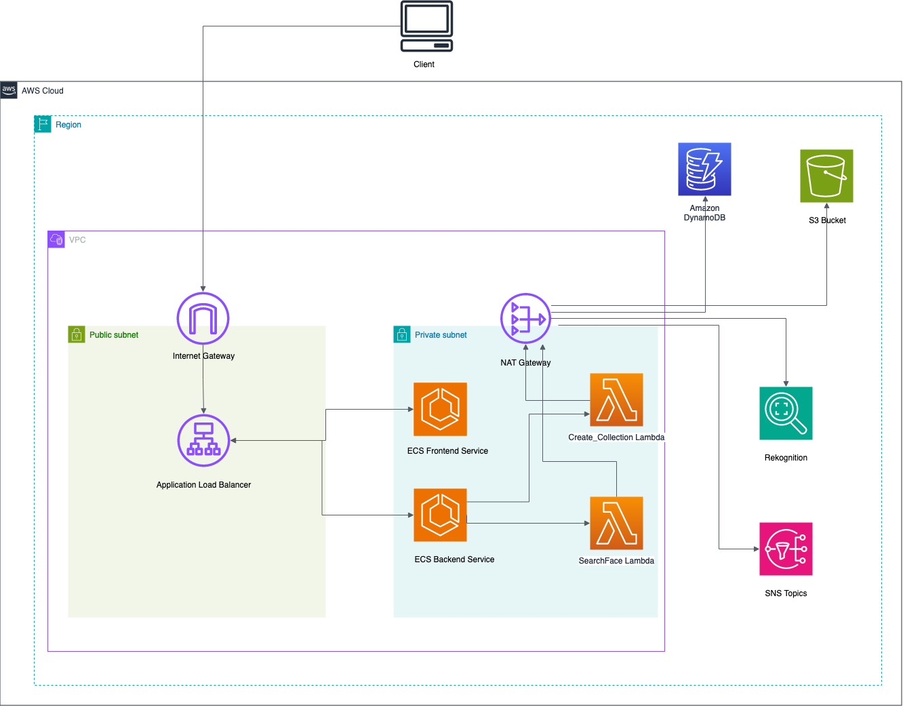

# Imagicon
Imagicon is a specialized platform designed to provide users with advanced image sorting and retrieval capabilities. At its core, Imagicon allows users to upload albums and then sort and retrieve specific images based on facial recognition technology. This innovative feature enables users to easily locate and download all pictures containing their face from a particular album. The platform aims to simplify the process of managing and accessing image collections. Whether users are looking to quickly find and download images featuring their face from a specific album or want to organize their image collections more effectively, Imagicon provides a comprehensive solution to meet their needs. Leveraging AWS services, the platform enhances the user experience by automating the image sorting process, making it easier and more efficient for users to manage their image collections.

# Architecture Diagram

# Workflow
For the deployment of the Imagicon website to the cloud, I have adopted an automated and
scalable approach using AWS CloudFormation along with other AWS services.
I have utilized AWS CloudFormation to provision and manage the infrastructure resources
required for the Imagicon website. With CloudFormation, I can describe all the AWS
resources needed for the application in a template file. This template file is then used to create
and provision the resources in an automated and repeatable manner, ensuring consistency and reducing the manual effort in deploying the application.
The Imagicon application is containerized using Docker. AWS ECS (Elastic Container
Service) is used to manage and orchestrate these Docker containers. The containers are deployed as tasks within ECS clusters, which are provisioned and managed by
CloudFormation. The serverless component of the application is deployed as AWS Lambda functions. To ensure security and isolation, the application resources are deployed within a Virtual Private Cloud (VPC). CloudFormation provisions the necessary VPC, subnets, and security groups to ensure the application's network resources are securely deployed and accessible. An Elastic Load Balancer (ELB) is used to distribute incoming application traffic across multiple targets, such as ECS tasks. The ELB configuration is also defined in the
CloudFormation template to ensure the proper distribution of incoming traffic.